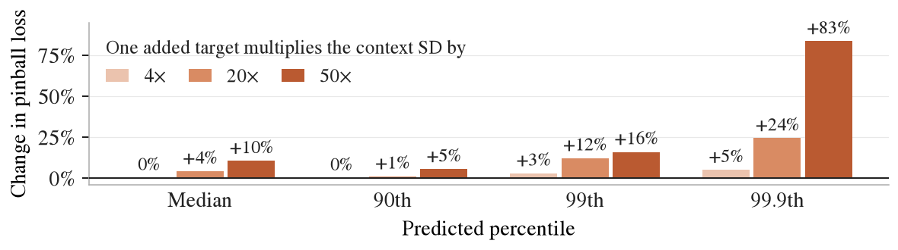
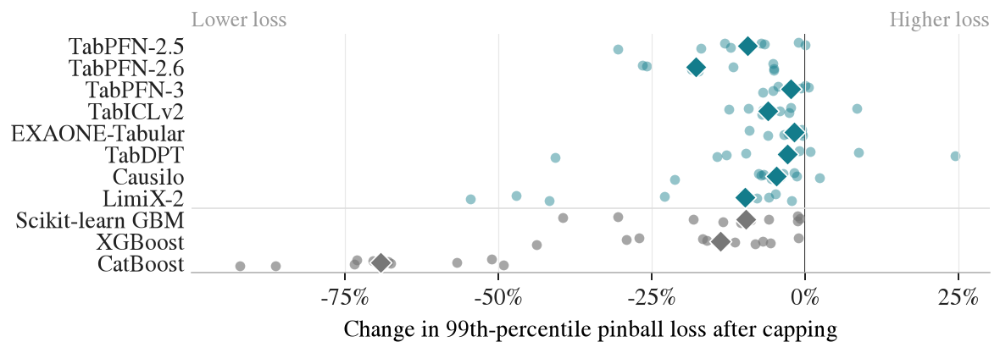

# Upper-tail predictions in tabular foundation models

Experiments for my master's thesis on how tabular foundation models predict
large target values, how one extreme value in the context changes their predictions,
and whether capping that value improves accuracy.

## Main results

On 40 synthetic tasks, one added extreme target made the context standard deviation
50 times larger. TabPFN-3's median increase in pinball loss was **83% at the 99.9th
percentile**, compared with **10% at the median**. Capping brought median losses
back close to the clean-context baseline at all four percentiles.



On ten samples of the freMTPL2sev insurance claims, each with one dominant claim,
capping lowered the 99th-percentile loss in most samples for every model. TabDPT
improved in **7 of 10**; the other models improved in **9 or 10**. These are selected
samples from one dataset; the results do not establish that capping helps on every new
task.

The figure includes LimiX-2 and Causilo, released in September 2026 and first and third
on the TabArena leaderboard of 28 September. Like the models measured before, both
standardise the target by its mean and standard deviation; one added row moves their
upper quantiles ([notebook](analysis/models_2026_09.ipynb)).



## Reproduce the figures

From the repository root:

```bash
python -m pip install -e ".[analysis]"
python -m analysis.supplement_figures
```

This uses stored results and needs no model weights, data download or GPU.
Plotted values are written to `supplement/`, which is not tracked; README images go
to `figures/`.

## Code and results

- `common/`: data loading, model adapters and metrics.
- `experiments/`: experiment scripts; `run/`: batch runs.
- `results/`: measured results; `results/provenance.csv` records the commit, package
  versions and settings of every run. The commits are from the development history,
  which is not published in full. `requirements/`: model environments.
- `data/`: dataset selections and sources.
- `analysis/`: notebooks for [shape and scale](analysis/h1_shape_vs_scale.ipynb),
  [extreme context targets](analysis/h2_leverage.ipynb),
  [repairs](analysis/h3_repair.ipynb) and
  [the models released in September 2026](analysis/models_2026_09.ipynb).

[Measurement rules](RULES.md) · [Predictions and outcomes](PREREGISTRATION.md)
· [Three framings of the topic](FRAMINGS.md)
